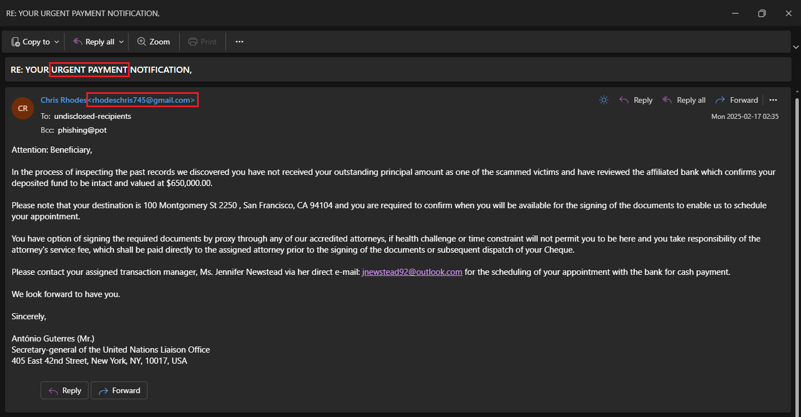
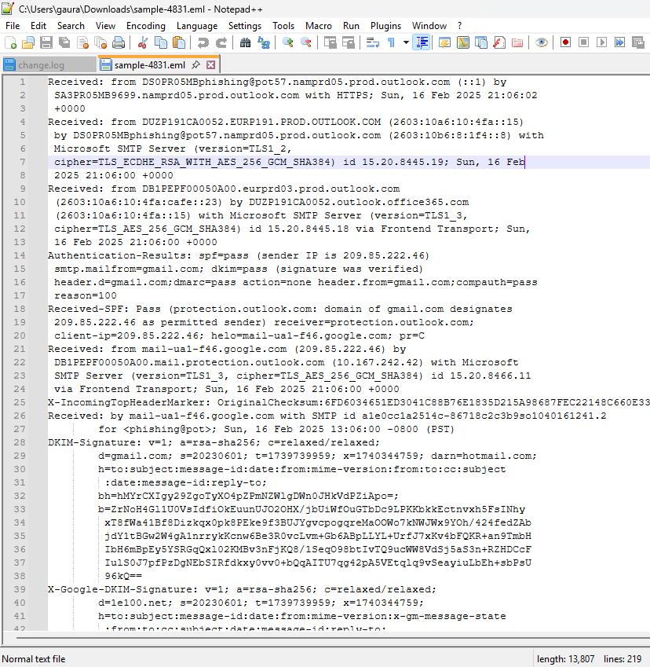
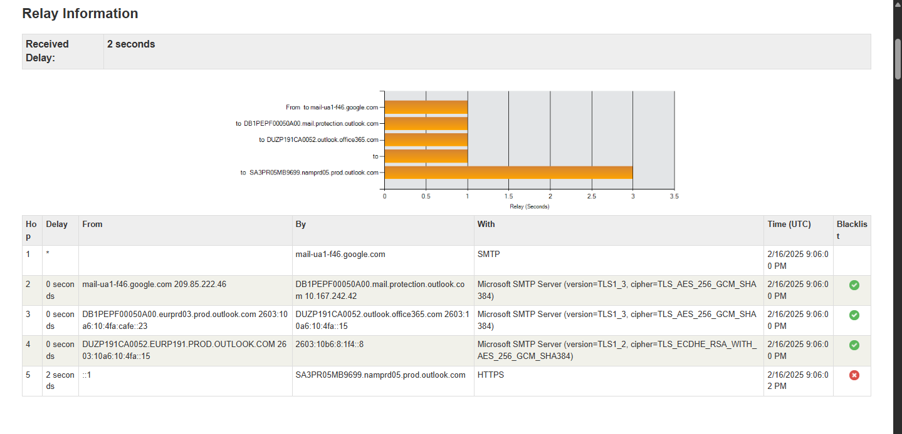
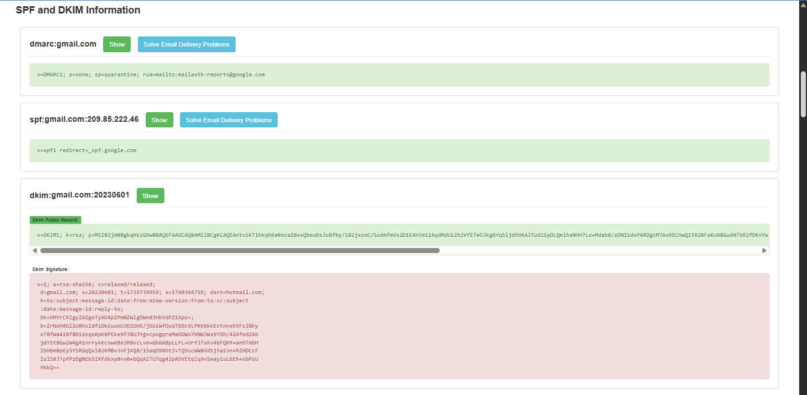
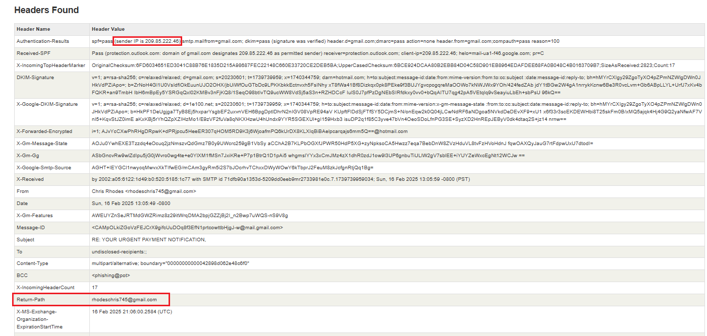

# 🎯 **Phishing Email Analysis & Threat Detection**

---
## 🚀 Project Overview

This project demonstrates **real-world phishing email detection and analysis**. You will find an in-depth walkthrough of identifying, analyzing, and reporting phishing threats using forensic techniques, email header analysis, and social engineering awareness.

---

## 📋 **Table of Contents**
- [Project Summary](#project-summary)
- [Phishing Email Sample](#phishing-email-sample)
- [Step-by-Step Analysis](#step-by-step-analysis)
  - [Sender Spoofing](#step-2-examine-senders-email-address-for-spoofing)
  - [Email Header Investigation](#step-3-check-email-headers-for-discrepancies)
  - [Suspicious Links/Attachments](#step-4-identify-suspicious-links-or-attachments)
  - [Urgency & Threat Language](#step-5-look-for-urgent-or-threatening-language)
  - [Mismatched Domains](#step-6-note-any-mismatched-urls)
  - [Grammar & Formatting](#step-7-verify-presence-of-spelling-or-grammar-errors)
  - [Phishing Traits Summary](#step-8-summarize-phishing-traits-found-in-the-email)
- [Screenshots & Evidence](#screenshots--evidence)
- [Interview-Ready Q&A](#interview-ready-qa)
- [How to Use](#how-to-use)
- [References](#references)
- [License](#license)

---

## 📝 **Project Summary**

This project walks through the forensic investigation of a **phishing email** targeting high-value victims using impersonation, urgency, and social engineering. Each step highlights key indicators, technical checks, and reporting methods that are critical for cybersecurity professionals.

---

## 🕵️‍♂️ **Phishing Email Sample**

- **File:** [`sample-4831.eml`](sample-4831.eml)
- **Claimed Sender:** António Guterres (UN Secretary-General)
- **Actual Sender:** Chris Rhodes `<rhodeschris745@gmail.com>`
- **Subject:** RE: YOUR URGENT PAYMENT NOTIFICATION

---

## 🧑‍💻 **Step-by-Step Analysis**

### **Step 2: Examine Sender's Email Address for Spoofing**
- **Display Name:** Chris Rhodes
- **Sign-off:** António Guterres
- **Red Flags:**
  - UN officials use official domains, not Gmail.
  - Sender name and sign-off mismatch.

**Conclusion:** Strong indication of spoofing.

---

### **Step 3: Check Email Headers for Discrepancies**
- **Headers:**
  - `Return-Path:` matches "From" (easy to fake).
  - Passed through Gmail and Outlook servers.
  - **SPF/DKIM/DMARC:** Pass (see screenshot below).

> **Note:** Even if technical checks pass, content can be fraudulent (social engineering).

---

### **Step 4: Identify Suspicious Links or Attachments**
- **No direct phishing links.**
- **Lure:** Requests contact with `jnewstead92@outlook.com` (advance-fee scam).
- **No attachments:** Social engineering risk remains.

---

### **Step 5: Look for Urgent or Threatening Language**
- **Subject:** "URGENT PAYMENT NOTIFICATION"
- **Body:**
  - "You are required to confirm when you will be available"
  - "Attorney's service fee must be paid"
- **Tactics:** Urgency, pressure, financial bait.

---

### **Step 6: Note Any Mismatched URLs**
- **No hyperlinks.**
- **Domain mismatch:** Claims to be UN, uses Gmail/Outlook.

---

### **Step 7: Verify Presence of Spelling or Grammar Errors**
- "We look forward to have you" (incorrect grammar)
- Inconsistent capitalization ("Cheque")

---

### **Step 8: Summarize Phishing Traits Found in the Email**

| Indicator          | Example/Description                                                  |
|--------------------|---------------------------------------------------------------------|
| **Impersonation**  | Pretends to be António Guterres (UN) from Gmail                    |
| **Urgency/Reward** | Claims you’re owed $650,000; urgent action required                |
| **Social Engineering** | Requests contact with another email (attacker’s)                |
| **Grammar Errors** | Multiple mistakes: “We look forward to have you”, “Cheque”         |
| **Domain Mismatch**| Free Gmail/Outlook domains, not official UN addresses              |

---

## 🖼️ **Screenshots & Evidence**

| Screenshot                          | Purpose/Location                       |
|--------------------------------------|----------------------------------------|
| **Email Content View**               | Top section, shows actual scam email   |
| **Email Header Open in Notepad++**   | Step 3, technical header inspection    |
| **Original Raw Headers**             | Step 3, deep dive header evidence      |
| **Full MXToolbox Analysis Result Page** | Step 3, third-party header verification |
| **SPF/DKIM/DMARC Section**           | Step 3, validates technical authenticity |

---

## 💡 **Interview-Ready Q&A**

1. **What is phishing?**  
   Fraudulent attempt to obtain sensitive info by impersonating trusted entities via electronic communication.

2. **How to identify a phishing email?**  
   Look for sender spoofing, urgency tactics, suspicious links, domain mismatch, and grammar errors.

3. **What is email spoofing?**  
   Faking sender address, often using free email domains or mismatched display names.

4. **Why are phishing emails dangerous?**  
   They exploit trust and urgency to steal money or credentials, even if technical checks (SPF/DKIM) pass.

5. **What tools can analyze email headers?**  
   MXToolbox, Google Admin Toolbox, built-in email clients.

6. **What actions should be taken on suspected phishing emails?**  
   Do not click links/attachments, report to security team, block the sender, and educate users.

7. **How do attackers use social engineering in phishing?**  
   They create urgency, impersonate authority, and request sensitive responses or payments.

---

## 🛠️ **How to Use**

1. **Open the `.eml` file** in your email client or Notepad++.
2. **Review screenshots** for step-by-step analysis and technical evidence.
3. **Run header analysis** using MXToolbox or similar tools.
4. **Check this README** for phishing indicators and reporting templates.

---

## 📚 **References**

- [MXToolbox Email Header Analyzer](https://mxtoolbox.com/EmailHeaders.aspx)
- [Google Admin Toolbox](https://toolbox.googleapps.com/apps/messageheader/)
- [OWASP Phishing Guide](https://owasp.org/www-community/Phishing)

---

## 📄 **License**

This project is released under the [MIT License](LICENSE).

---

> **Created by Gaurav Mahajan**
> 
> [LinkedIn: Gaurav Mahajan](https://www.linkedin.com/in/gaurav-mahajan-1155561b1/)
> 
> *For interview prep, cybersecurity portfolio, and practical threat detection training.*